## 1. 找到服务器

1. 打开先购买阿里云服务器ECS  推荐新手买windowserver版本

2. 买好了之后登陆阿里云的 进入云服务器控制台

   https://ecs.console.aliyun.com/#/home

3.  进入了之后 点击自己买的云服务器

   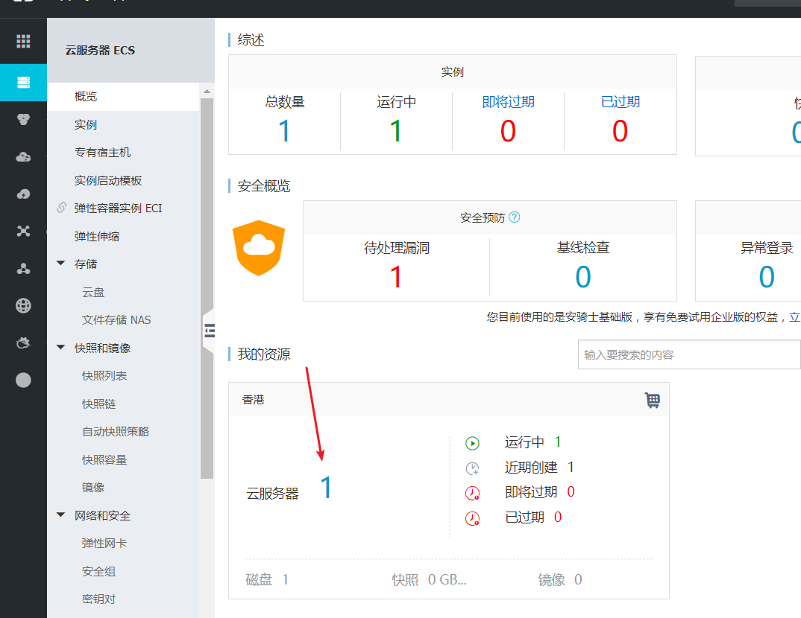

   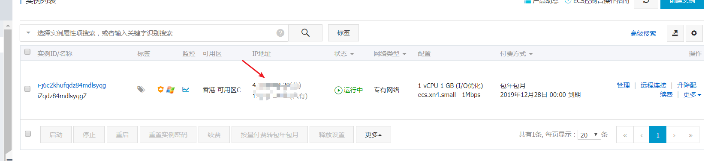

这里就是你买的云服务和 ip地址

## 2. 连接服务器

1. 点击远程连接可以连接云服务器

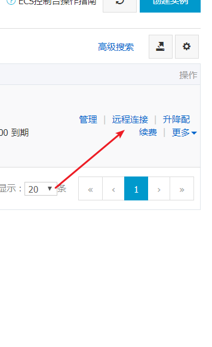

2. 第一次会弹出密码 如果不知道的可以点击 修改密码

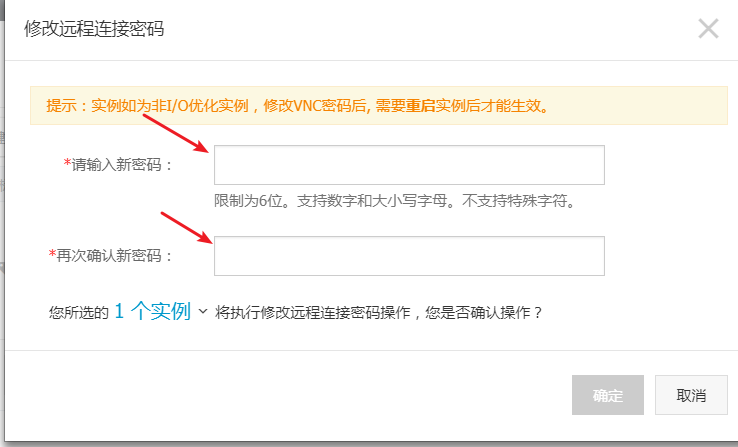

3.  修改了之后吧当前修改的密码在远程连接窗口输入

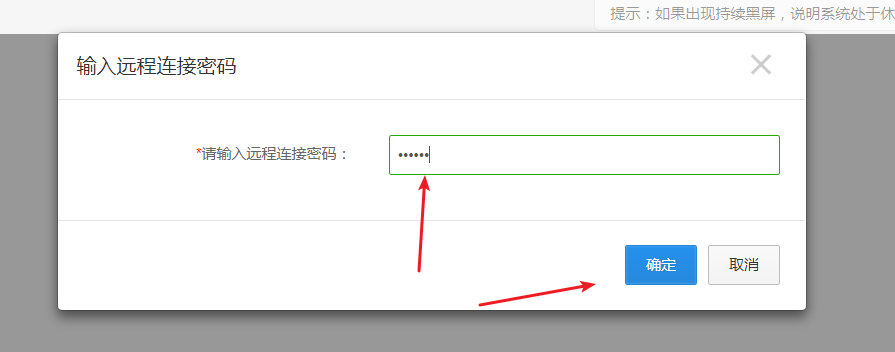

点击确定就可以看到你买的服务器了

4. 然后点击左上角的发送远程命令可以打开服务器电脑

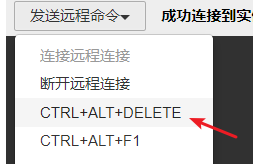

5. 输入密码点击确定即可

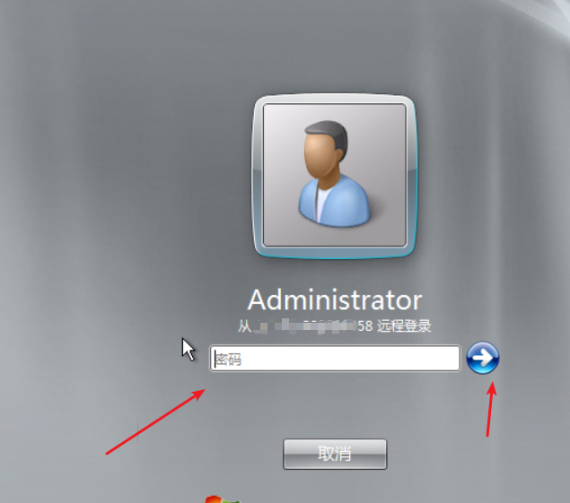

6. 如果密码不知道的 点击重设密码

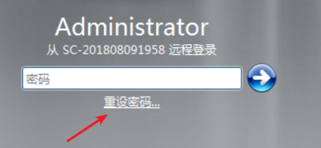

7. 或者点击 控制台的 重设密码后

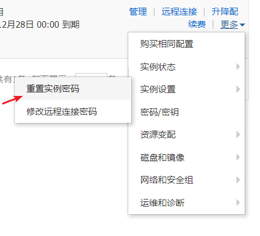

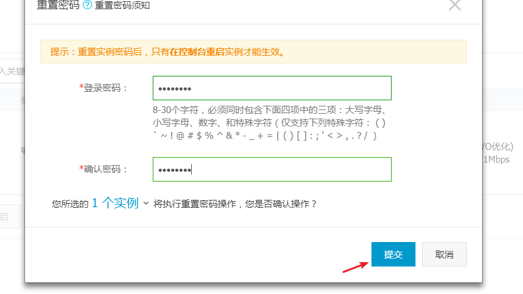

重设后会自动重启服务器等待几分钟即可

然后重新进入远程连接 登录进去

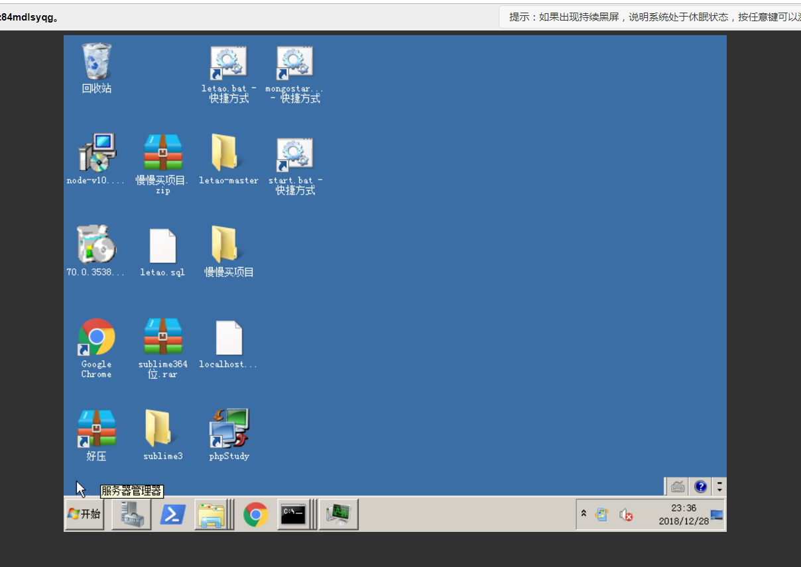

8. 就可以看到自己的远程桌面了

9. 可能一开始什么都没有 需要自己把文件拷贝进去 那么如何拷贝文件呢 在这网页里面是不行的要使用windows电脑的远程桌面连接才可以

10. 打开cmd 输入mstsc 回车

    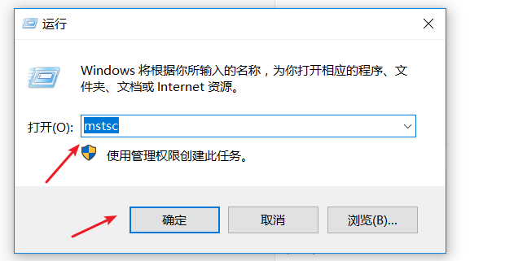

11. 然后输入自己的服务器公网ip 点击连接

    

12. 第一次可能会要输入密码 密码就是你远程电脑的开机密码(登录密码)

    

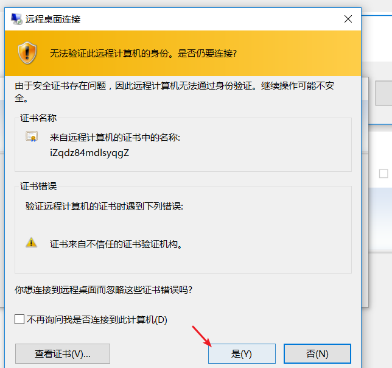

然后点击是就可以连接了 当然你电脑得联网才行

13. 这个时候你可以通过一个窗口打开你的服务器电脑 这个时候就跟操作自己电脑一样可以复制粘贴文件进去

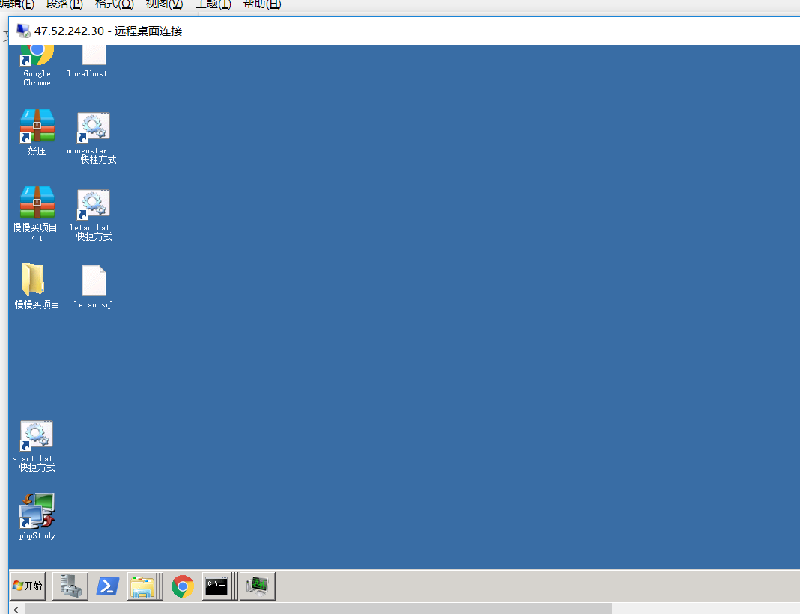

## 3. 搭建网站

1. 那么怎么搭建网站呢 有很多种方式 第一 可以使用 phpstudy在 服务器电脑安装phpstudy 然后在phpstudy的 www目录里面放置自己的网站跟之前自己在电脑上玩phpstudy是一样的操作

   然后启动phpstudy的 服务

   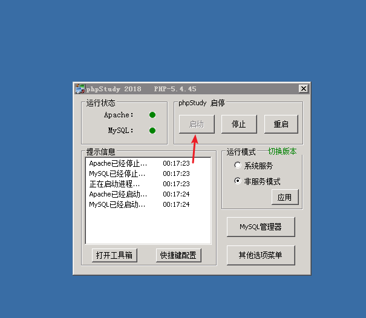

2. 把你当网站放进www目录

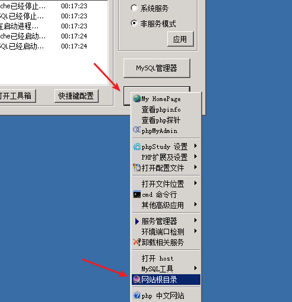

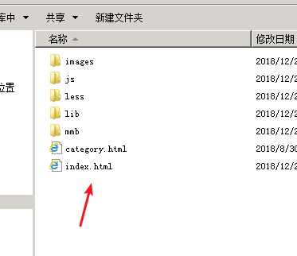

3. 就把一个任意的项目静态的或者php的放进去都可以

4. 最关键来了怎么让你的网站能够让外网访问呢

5. 回到阿里云控制他打开更多设置

   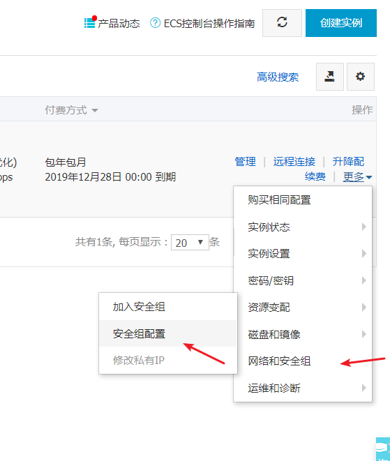

   6. 设置安全组配置 点击配置规则

   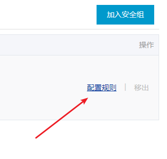

   7. 点击添加安全组规则 如果不添加的话这个端口号是外网是无法访问的

   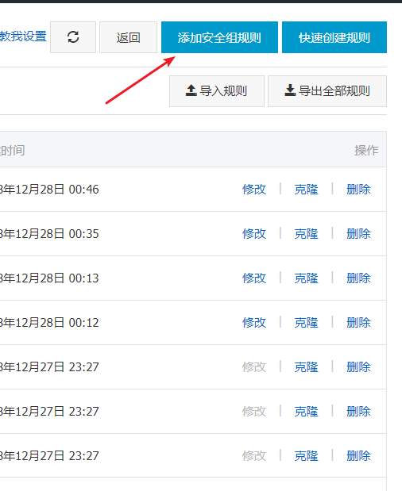

   8. 输入你要访问的端口号和授权对象 （写 0.0.0.0/10）即可

   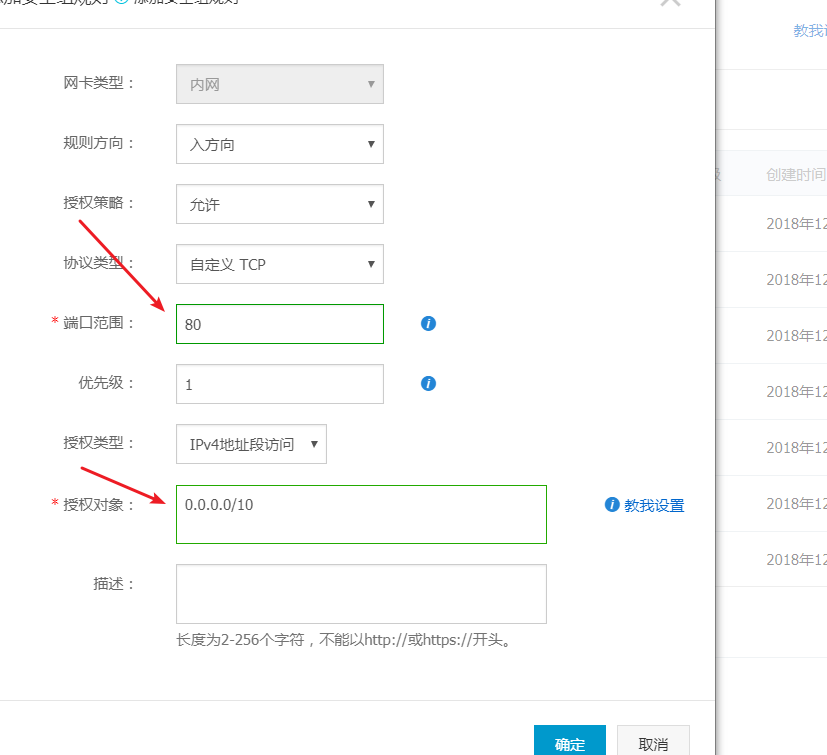

   9. 点击确定就可以看到一个安全组规则

   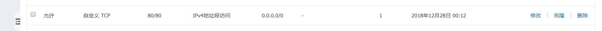

   10. 有了之后去访问你的公网ip即可看到你上传的网站了

   

   

11. 那么如果你还有别的端口号例如 3000  9090等都是安装上述方式添加安全组 然后服务器里面开启你的node.js服务器就可以访问了

后续还有搭建node js 服务器 翻墙服务器等教程更新